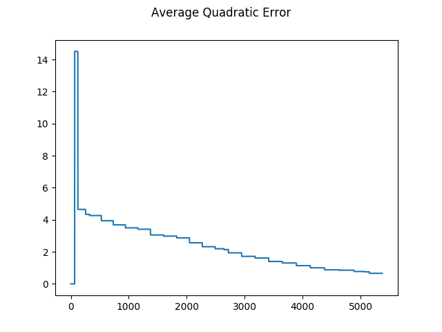
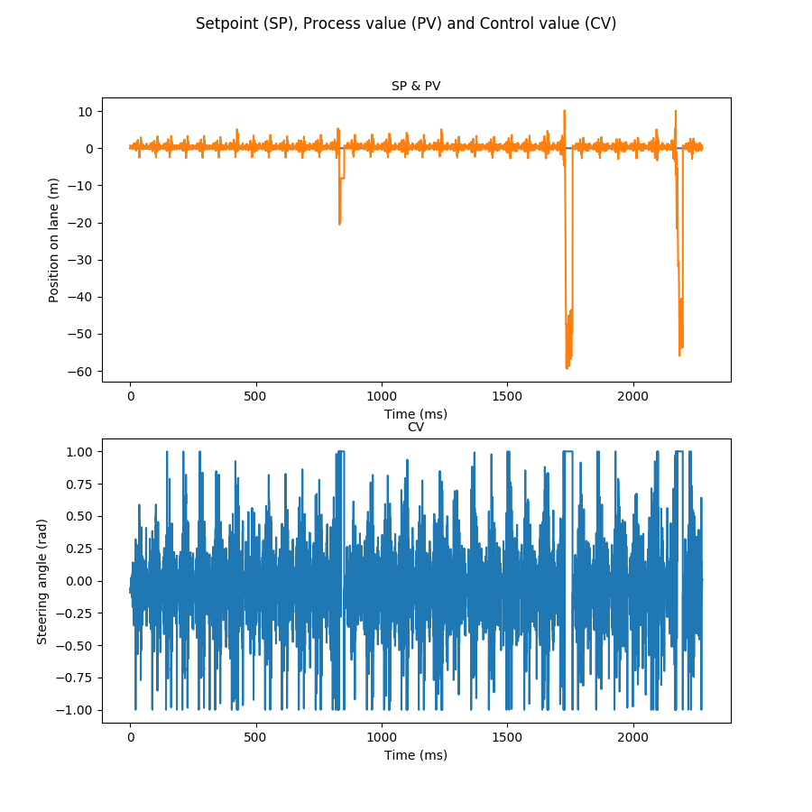
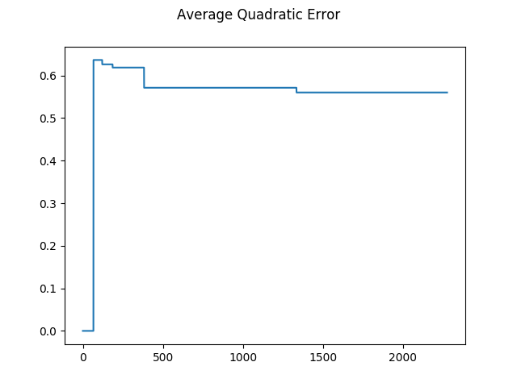
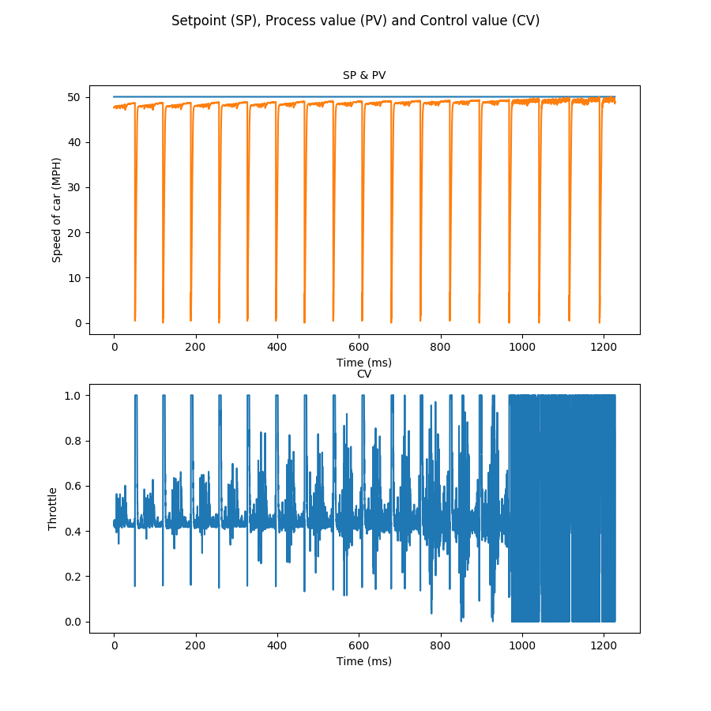
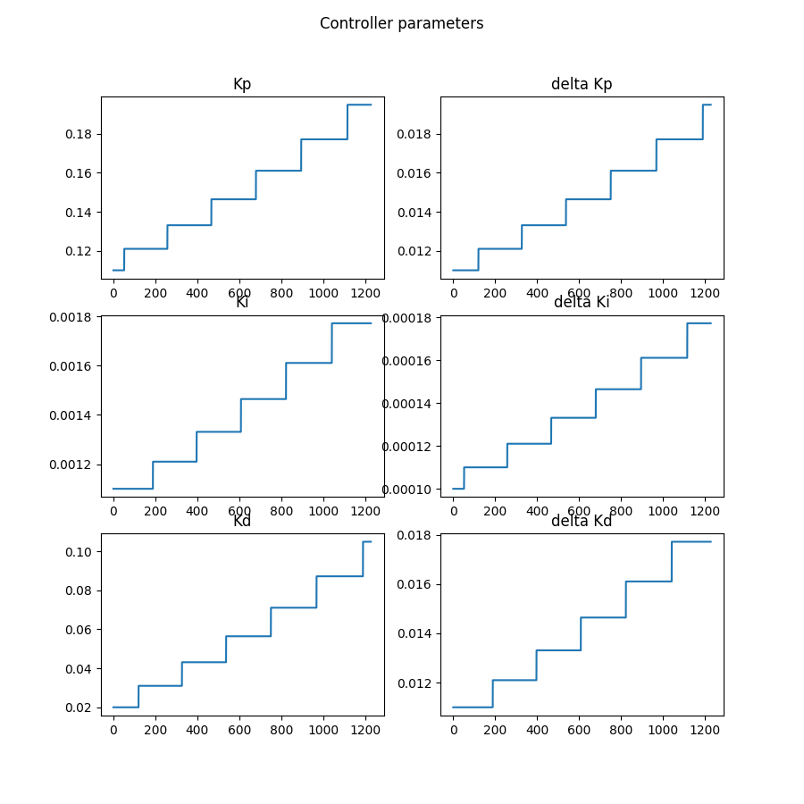

# Self driving car nanodegree

## Project 8: PID Controller

This project consists of a control system used to determine the steering angle and throttle needed to drive a car safely at the center of a street with a given speed. 

This software is programmed in C++11 using the standard template library. The ilustrative plots are done with Python using Matplotlib. The software works together with the [ Udacity term 2 simulator ](https://github.com/udacity/self-driving-car-sim) which sends the lateral position of the car, its current steering angle and its current speed and receives the new calculated steering angle and the new calculated throttle on every cycle.

To compile the software, GCC 7.4.0 and CMake 3.15.0-rc1 is used.

### About the control system
The process that needs to be controlled, in this case the autonomous car is a coupled system, where the position of the car on the lane depends on the steering angle but also on the current speed of the car. Leaving aside this fact, the system is still not easy to control, since the car needs to drive on a track with many sharp curves that cause disturbances on the position control loop. All these facts make the car very difficult to be controlled with a simple PID controller.

Therefore I decided to use a cascade control structure which can be explained better with the following drawing:

 

### Control theory 
In order to understand this project, some concepts of control theory need to be explained. Before tunning a PID control loop it needs to be understood how this controller works and what the parameters are for.

The P component is the one responsible of making the controller to look for the setpoint (desired value). It adds to the controller output a number proportional to the difference between the setpoint and the current value (also called process value PV), this difference will be called from here on control error.  The optimal P parameter for a system can be found analytically, but this can only be done if the mathematical model is linear and completely known. A controller with a P part section can hardly control any system and therefore PI, PD or PID are normally used. At the same time, a controller without a P section would also not work. In the case of the position loop of this system, a pure P controller will oscillate with any given parameter because of the disturbances caused by the street curves.

The D component is the one responsible of minimizing the oscillations of the system. It adds to the controller output a number proportional to the derivative of the control error at that time, making the controller output bigger if the error is moving rapidly and smaller in the contrary case. Doing this it gives more weight to larger changes on the controller value, acting as a kind of low pass filter. In the case of the position loop, the D parameter will minimize the oscillations caused by the curves, making the system more stable.

The I component is the one responsible of minimizing a possible offset on the process value of the controller. There are cases when a controller might control a process very well, but the process value will always be an offset far away from the setpoint. This can be caused by the process itself or by the initial conditions of the system. The I component adds to the controller output a number proportional to the integral of the control error, making control outputs where this integral is bigger stronger and viceversa.

The difference between the effect of the different parameters can be visualized on the following gif:
 

As explained above, it can be seen how the P controller oscillates very strongly and does not reach the setpoint, the I helps to reach the setpoint making the offset smaller but it also causes even bigger oscillations and the D corrects those oscillations. 

The general formula of a PID controller is the following:

Where: 

or:

 : Control value, the output of the controller which is used on the actuator (throttle and steering angle in this system).

 : Process value, corresponds to the current value of the variable being controlled (Current speed and position on lane in this system).

 : Setpoint, corresponds to the desired value of the variable being controlled.

 : Control error, as seen on the equations (2) and (3), corresponds to the difference between the setpoint and the process value or to the difference between the process value and the setpoint. In the case of both control loops of this system the equation (2) is used.

,  and  correspond to the parameters of a PID controller.

Since a PID controller is executed on a computer, a discrete version of the equation (1) needs to be used. this equation would be:

Where:
 : Time step being executed.

 : Time length between executions of the PID controller.

This one is the equation used on the algorithm within the method "updateController" of the "PID" class.

### Tunning procedure and results
Tunning a control loop consists on finding the best parameters for the desired control behaviour. 

In a normal case, the inner control loop would be tunned first, but in this case, that is imposible, since it is needed that the car drives at least fairly well in order to be able to tune the speed loop. Therefore the first step here was to tune the position loop.

The parameters can be tunned manually using methods like the  [Ziegler-Nichols method ](https://en.wikipedia.org/wiki/Ziegler%E2%80%93Nichols_method) or automatically using optimization methods like [Stochastic Gradient Descent](https://en.wikipedia.org/wiki/Stochastic_gradient_descent) or the easier to implement coordinate ascent, also called "twiddle". A small explanation of the "twiddle" algorithm can be found [here](https://martin-thoma.com/twiddle/).

After some trying with manual methods I found out that this system is very sensible to parameter changes, so finding the optimal parameters will be very difficult with manual methods. 

Therefore I decided to implement an online version of the "Twiddle" algorithm, which can be executed on every simulator cycle. The algorithm can be found on the method "twiddleOpt" of the class PID.  The algorithm minimizes the average quadratic control error of the last 1000 measured points and resets the simulator for every iteration, so the average quadratic control errors are completelly comparable between each other.

In order to get good results with the "twiddle" algorithm, good start parameters are needed. So I first tunned the control loop manually until getting a "decent" response, these start parameters were P = 0.035, I = 0.0, D = 0.2. The update steps for the twiddle algorithm selected at the beginning were dP = 0.001, dI = 0.0 and dD = 0.1, so only the P and D parts were optimized at the beginning. This optimization was done with a relative constant speed of 40 mph and after 1 and a half hours it reached the parameters P = 0.114543, I = 0.0, D = 0.0453001 and the update steps dP = 0.0089543, dI = 0.0 and dD = 0.0161819. This reached an average squared error of 0.657443, which is way better than the 14.5082 at the beginning. 

In the following images it can be seen how the response of the system changed during the optimization.

 
 
 

It can be seen how the oscillations get smaller but they do nott dissapear. On the other side, the average quadratic error does really get better.

The next step was to optimize further, but this time including the I part. The start parameters and update steps were the ones obtained through the last optimization but changing I to 0.002 and dI to 0.0001, also this time the speed was increased to 50 mph. The parameters obtained after this optimization were P = 0.142301, I = 0.002, D = 0.0632458 and the update steps were dP = 0.00710865, dI = 5.9049e-05, dD = 0.0128465 reaching a quadratic error of 0.560109. 

In the following images it can be seen how the response of the system changed during the optimization.

 
 
 

It can be seen that the oscillations became even smaller, even if the car was faster. But also it can be seen that the car went out of the road at some steps of the optimization. At this point it seemed very clear that the position loop will not get any better without doing something with the speed as well.

In order to tune the speed loop, the position loop parameters were kept at the values obtained on its last optimization and the twiddle optimization was used on the speed loop with start parameters P = 1.0, I = 0.001, D = 0.01 and update steps dP = 0.01, dI = 0.0001, dD = 0.01 with a speed setpoint of 50 mph the quadratic error on that loop decreased from 4.2654 to 0.112728 with parameters P = 0.1353848, I = 0.00177156, D = 0.0871561 and update steps dP = 0.00194872, dI = 0.000177156 and dD = 0.0177156. The results of this optimization can be seen on the following images:

 
 
 

It can be seen how the real speed moved to values very close to the setpoint with very small oscillations. It need to be noted that on the image including SP and PV, the lower peaks correspond to the moments when the simulation is restarted, so they are not important for the optimization process.

A negative thing is, that at the last moments of the optimization the controller reached a point where it is "overoptimized", reacting very fast but also more oscillative than desired, therefore I decided to revert the parameters to the last moment when this effect did not happen, having the parameters P = 0.137334, I = 0.00137156, D = 0.0671561. 

Since when using the desired control structure the speed setpoint gets changed depending on the steering angle of the car, the speed loop does not need to be as exact as the position loop, therefore these parameters were taken as the definitive ones for this loop.

The next step was starting to use the desired control structure to optimize the position loop further. After optimizing the position loop using the start parameters P = 0.142301, I = 0.0002, D = 0.0632458 and the update steps dP = 0.00710865, dI = 5.9049e-05, dD = 0.0128465 using now the desired control structure the quadratic error was reduced from 0.560109 to 0.405161 with final parameters P: 0.155743, I: 0.00206489, D: 0.0632458 and update steps dP: 0.00411405, dI: 4.64091e-05, dD: 0.004977. The optimization process can be visualized on the following images:

 
 
 

It can be seen that the oscillations did not really became better, but the average quadratic error did. It also seems that the algorithm reached a local minimum, therefore in order to optimize further  the start parameters need to be changed. Looking for the perfect parameters for this control loop could easily take a lot of days of work.

### Results and conclusions

In the following video it can be seen more clearly how the system works with these parameters.

 

This corresponds exactly to the following image: 

The position still oscillates strongly arround the setpoint, indicating that the system is in a state called "marginally stable", this is an oscillative state, where the amplitude of the oscillations is constant. As said before, new parameters could be searched, but this can take a lot of time using the twiddle algorithm because of reaching a local minimum. Also there is the possibility that no stable state exists for this system.

The remaining oscillations can be decreased using a deadband, this means, if the difference between the setpoint and the process value is smaller than a given value, the error will be zero for the controller. Using a deadband of 0.2 the results on the following video were reached.

 

This corresponds exactly to the following image:

It can be seen that the oscillations became a little bit smaller, but the amplitude of the oscillations on the steering angle became bigger. Using a higher deadband value does not really help any further. At the end it is needed to choose between a bit more oscillations on the position but softer steering angles or smaller oscillations on the position but harder steering angles. Another solution which may help to make the oscillations smaller is to use a filter for the position of the car on the lane, so the controller uses the filtered position instead of the current one.

The PID controller is a very strong tool used to control many processes. It works very well on controlling temperature, flow or liquid level, since these processes are more simple because mostly they do not depend on other variables. In the case of this system, as said before, the position and speed processes are strongly coopled, making it very difficult to control with PID controllers, also the curves of the street are disturbances that make the controlling process even more difficult.

For the control of this process a more advanced technique like [model predictive controller](https://en.wikipedia.org/wiki/Model_predictive_control) , [fuzzy logic controller](https://en.wikipedia.org/wiki/Fuzzy_control_system)  or even a neural network like on the [project 4 (Behavioral cloning) ](https://github.com/j-rilling/SDCND_Behavioral_Cloning) would work better. 

### How to use
The software is already compiled in this repository in the folder "build", but here is explained how it can be compiled again:

- Install the required dependencies: gcc/g++ >= 5.4, make >= 4.1, cmake >= 3.5.
- Install uWebSockets using the file ./install-ubuntu.sh
- Delete the directory build and create a new one with: mkdir build.
- Move to the build directory with: cd build.
- Compile with: cmake .. && make.
- Run the program with: ./pid.
- Open the term 2 simulator and select Project 4: PID Controller.
- Press start and see how the simulation runs.

These steps are for a linux environment. For other operative systems see the [Udacity's repository](https://github.com/udacity/CarND-PID-Control-Project).

 
